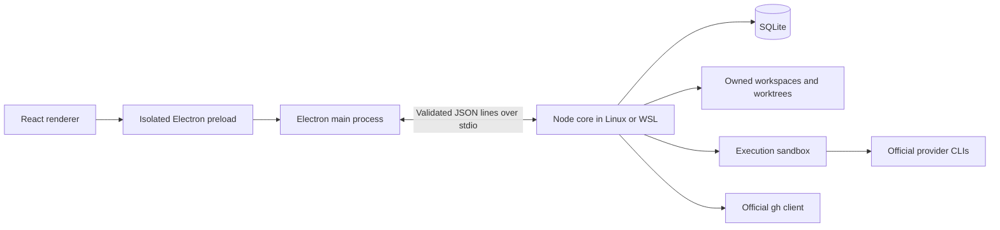

# Architecture

Vibestar separates the desktop interface from the local authority that owns processes, Git,
workspaces and saved state. This page is a map of those boundaries; operational and compatibility
details live in the linked guides.

## System overview

```mermaid
flowchart LR
  UI[React renderer] --> Preload[Isolated Electron preload]
  Preload --> Main[Electron main process]
  Main <-->|Validated JSON lines over stdio| Core[Node core in Linux or WSL]
  Core --> DB[(SQLite)]
  Core --> Git[Owned workspaces and worktrees]
  Core --> Sandbox[Execution sandbox]
  Sandbox --> CLI[Official provider CLIs]
  Core --> GH[Official gh client]
```

On Linux, Electron and the Node core run on the host. On Windows, Electron presents the desktop and
starts the core inside a selected WSL distribution. Git, provider tools, SQLite and session data remain
in Linux. The application uses a narrow stdio bridge rather than an application HTTP server.

## Runtime boundaries

The React renderer presents saved and observed state. It has no Node integration. Electron keeps
context isolation and Chromium sandboxing enabled. The preload exposes a typed API; the main process
validates the sender and forwards requests to the core. Compatibility negotiation prevents a newer
renderer from sending unsupported mutations to an older WSL helper.

The core validates each request and owns database access, filesystem operations, Git, process
lifecycles and provider invocation. Repository content, issue text and model output provide context;
they do not grant permission to mutate host data. Core-managed provider and verification commands
run inside the required sandbox. The user-operated terminal runs with the user's Linux/WSL
permissions after workspace ownership checks. See the [security guide](docs/security.md).

## Module ownership

| Area                                                 | Responsibility                                                               |
| ---------------------------------------------------- | ---------------------------------------------------------------------------- |
| `apps/electron/`                                     | Desktop lifecycle, isolated preload, stdio bridge and platform contracts     |
| `apps/desktop/app/`                                  | Navigation, desktop composition and global actions                           |
| `apps/desktop/features/`                             | Feature-owned UI: Vibers, Sessions, Settings, Usage                          |
| `apps/desktop/components/` and `apps/desktop/hooks/` | Reusable controls and hooks shared across features                           |
| `apps/core/rpc/`                                     | Validated domain requests; `apps/core/rpc.ts` composes services and dispatch |
| `apps/core/vibers/`                                  | Viber profiles, appearance, sessions, message store and continuity           |
| `apps/core/execution/`                               | Agent runner, providers (Codex, Antigravity), sandbox, output and usage      |
| `apps/core/workspace/`                               | Git operations, path ownership, worktrees and runtime mounts                 |
| `apps/core/storage/`                                 | SQLite lifecycle, migrations, recovery, inspection and cleanups              |
| `tests/`                                             | Unit, integration and security coverage                                      |

Feature-specific code belongs with its owner. Shared renderer primitives stay under `apps/desktop/components`
and ordered CSS chapters under `apps/desktop/styles/`. Detailed folder and check ownership is documented in
the [contributor guide](CONTRIBUTING.md) and [testing guide](docs/testing.md).

## Desktop tool overlays

The dock and command palette open Repositories, Providers, Usage and Settings in modal overlays
inside the main window. The active Viber conversation stays mounted below the overlay. Closing the
overlay restores focus to its opener.

Settings serializes core settings and desktop configuration saves in separate queues. Failed fields
roll back to their acknowledged values. Settings finishes pending saves before closing.
Visited panels keep their form values and scroll positions while the overlay remains open. Desktop
configuration changes require native confirmation. The core refuses restart while activity exists
and closes admission before stopping. Providers, Repositories and Storage use the same services
from their Settings panels and their standalone surfaces where applicable.

Each renderer has one `react-hot-toast` Toaster that renders through `apps/desktop/lib/notifications.tsx`. It follows the active
native modal's top layer without stealing focus. The saved notification preference filters optional
messages; errors, required input, blocking warnings and essential runtime installation progress remain
visible. A display-only cache of the acknowledged preference covers startup before the core connects;
the core remains authoritative. Runtime status is cached by Electron so a renderer arriving after startup can display the
current stage. The existing WSL installer runs before helper loading only when bundled bytes, the
locked dependency manifest or native ABI/dependencies need recovery. It acquires the existing core
ownership lock and refuses runtime aliases. Custom helper paths remain user-managed. Retry probes
again; explicit Repair Runtime can reinstall. Linux launches bypass this WSL setup path.

Retired global Utility AI and Review AI fields are stripped when reading settings and disappear on the
next settings save; reads preserve original saved bytes. Model, provider, and reasoning effort are selected
dynamically per turn in the Viber composer rather than from global model settings. No historical run is rewritten or replayed.

## Viber architecture and continuous conversations

Vibestar is built entirely around persistent AI employees called **Vibers**:

- **Simplified Viber identity**: Each Viber is defined by its name and custom appearance avatar. Viber creation requires only name and appearance; there are no mandatory descriptions, custom instructions, predefined roles, default model configs, or built-in presets (`planner`, `refiner`, `implementer`, `reviewer`). Essential internal runtime and security instructions are applied automatically.
- **One continuous chat per Viber**: Each Viber owns exactly one continuous conversation. There are no multiple-chat creation buttons or session-switching dropdowns. Selecting a Viber directly displays its ongoing continuous conversation and associated workspace. New chats start in managed workspaces. Existing repository-linked chats keep their dedicated worktrees.
- **Native provider session management**:
  - Separate native conversation IDs are maintained for Codex and Antigravity.
  - Native sessions are resumed seamlessly across turns and application restarts.
  - On a provider switch, a new native thread receives saved chat context. A resumed thread receives the messages added since its last completed turn.
  - Context compaction is delegated directly to the provider CLIs.
  - The unified message history serves as the durable source of truth.
- **Composer model selection**: Model, provider, and reasoning effort selection happen directly within the chat composer dynamically per turn.

## Persistence, verification and recovery

SQLite migrations safely pruned all retired workflow and monitoring tables and indices while preserving all Viber identities, appearances, continuous sessions, messages, native provider threads, and usage records.

Data-root migration, backup procedures, and workspace isolation enforce strict ownership boundaries so user files and repositories are never silently deleted.

## Maintainer guides

- [Security boundaries](docs/security.md)
- [Development and platform setup](docs/development.md)
- [Testing Guide](docs/testing.md)
- [Contributing](CONTRIBUTING.md)
- [Third-party notices](docs/third-party-notices.md)
