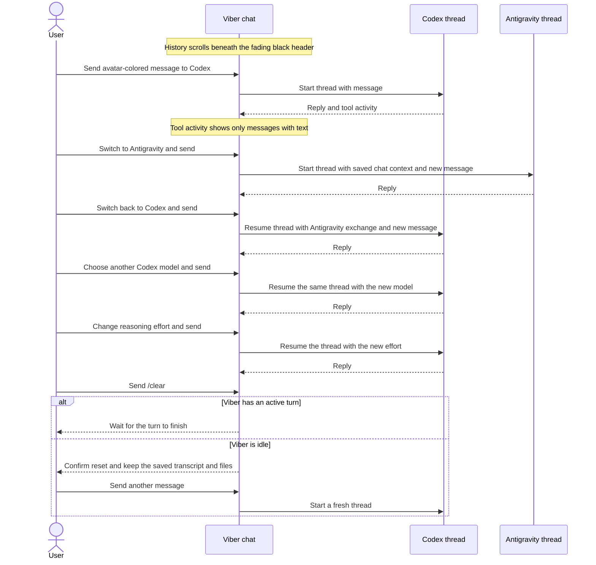

```mermaid
sequenceDiagram
    actor User
    participant Chat as Viber chat
    participant Codex as Codex thread
    participant AGY as Antigravity thread

    Note over Chat: History scrolls beneath the fading black header
    User->>Chat: Send avatar-colored message to Codex
    Chat->>Codex: Start thread with message
    Codex-->>Chat: Reply and tool activity
    Note over Chat: Tool activity shows only messages with text
    User->>Chat: Switch to Antigravity and send
    Chat->>AGY: Start thread with saved chat context and new message
    AGY-->>Chat: Reply
    User->>Chat: Switch back to Codex and send
    Chat->>Codex: Resume thread with Antigravity exchange and new message
    Codex-->>Chat: Reply
    User->>Chat: Choose another Codex model and send
    Chat->>Codex: Resume the same thread with the new model
    Codex-->>Chat: Reply
    User->>Chat: Change reasoning effort and send
    Chat->>Codex: Resume the thread with the new effort
    Codex-->>Chat: Reply
    User->>Chat: Send /clear
    alt Viber has an active turn
        Chat-->>User: Wait for the turn to finish
    else Viber is idle
        Chat-->>User: Confirm reset and keep the saved transcript and files
        User->>Chat: Send another message
        Chat->>Codex: Start a fresh thread
    end
```
