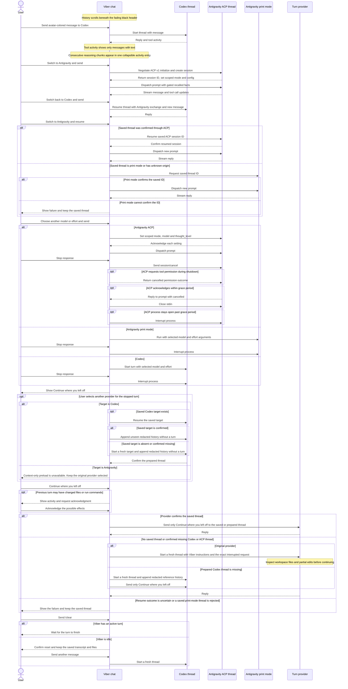
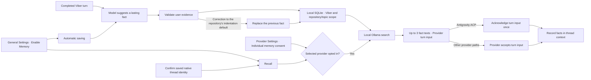
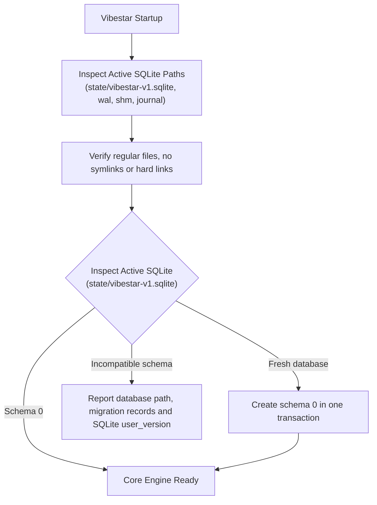
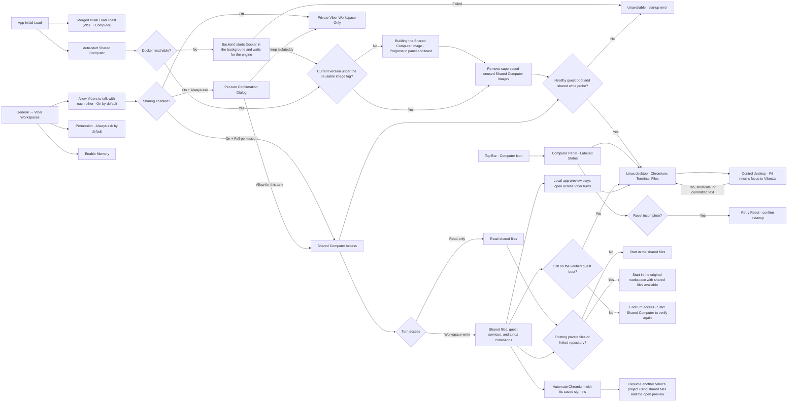
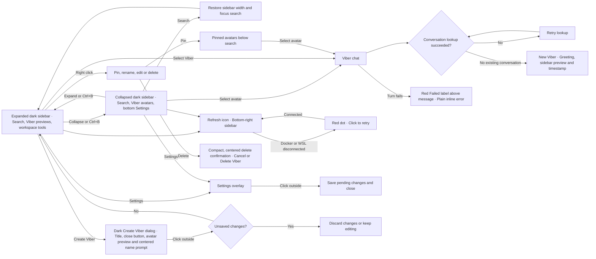

```mermaid
sequenceDiagram
    actor User
    participant Chat as Viber chat
    participant Codex as Codex thread
    participant AGY as Antigravity ACP thread
    participant Print as Antigravity print mode

    participant Provider as Turn provider
    Note over Chat: History scrolls beneath the fading black header
    User->>Chat: Send avatar-colored message to Codex
    Chat->>Codex: Start thread with message
    Codex-->>Chat: Reply and tool activity
    Note over Chat: Tool activity shows only messages with text
    Note over Chat: Consecutive reasoning chunks appear in one collapsible activity entry
    User->>Chat: Switch to Antigravity and send
    Chat->>AGY: Negotiate ACP v1 initialize and create session
    AGY-->>Chat: Return session ID, set scoped mode and config
    Chat->>AGY: Dispatch prompt with gated recalled facts
    AGY-->>Chat: Stream message and tool call updates
    User->>Chat: Switch back to Codex and send
    Chat->>Codex: Resume thread with Antigravity exchange and new message
    Codex-->>Chat: Reply
    User->>Chat: Switch to Antigravity and resume
    alt Saved thread was confirmed through ACP
        Chat->>AGY: Resume saved ACP session ID
        AGY-->>Chat: Confirm resumed session
        Chat->>AGY: Dispatch new prompt
        AGY-->>Chat: Stream reply
    else Saved thread is print mode or has unknown origin
        Chat->>Print: Request saved thread ID
        alt Print mode confirms the saved ID
            Chat->>Print: Dispatch new prompt
            Print-->>Chat: Stream reply
        else Print mode cannot confirm the ID
            Chat-->>User: Show failure and keep the saved thread
        end
    end
    User->>Chat: Choose another model or effort and send
    alt Antigravity ACP
        Chat->>AGY: Set scoped mode, model and thought_level
        AGY-->>Chat: Acknowledge each setting
        Chat->>AGY: Dispatch prompt
        User->>Chat: Stop response
        Chat->>AGY: Send session/cancel
        opt ACP requests tool permission during shutdown
            Chat-->>AGY: Return cancelled permission outcome
        end
        opt ACP acknowledges within grace period
            AGY-->>Chat: Reply to prompt with cancelled
            Chat->>AGY: Close stdin
        end
        opt ACP process stays open past grace period
            Chat->>AGY: Interrupt process
        end
    else Antigravity print mode
        Chat->>Print: Run with selected model and effort arguments
        User->>Chat: Stop response
        Chat->>Print: Interrupt process
    else Codex
        Chat->>Codex: Start turn with selected model and effort
        User->>Chat: Stop response
        Chat->>Codex: Interrupt process
    end
    Chat-->>User: Show Continue where you left off
    opt User selects another provider for the stopped turn
        alt Target is Codex
            opt Saved Codex target exists
                Chat->>Codex: Resume the saved target
            end
            alt Saved target is confirmed
                Chat->>Codex: Append unseen redacted history without a turn
            else Saved target is absent or confirmed missing
                Chat->>Codex: Start a fresh target and append redacted history without a turn
            end
            Codex-->>Chat: Confirm the prepared thread
        else Target is Antigravity
            Chat-->>User: Context-only preload is unavailable. Keep the original provider selected
        end
    end
    User->>Chat: Continue where you left off
    opt Previous turn may have changed files or run commands
        Chat-->>User: Show activity and request acknowledgment
        User->>Chat: Acknowledge the possible effects
    end
    alt Provider confirms the saved thread
        Chat->>Provider: Send only Continue where you left off to the saved or prepared thread
        Provider-->>Chat: Reply
    else No saved thread or confirmed missing Codex or ACP thread
        alt Original provider
            Chat->>Provider: Start a fresh thread with Viber instructions and the exact interrupted request
            Note over Provider: Inspect workspace files and partial edits before continuing
        else Prepared Codex thread is missing
            Chat->>Codex: Start a fresh thread and append redacted reference history
            Chat->>Codex: Send only Continue where you left off
        end
        Provider-->>Chat: Reply
    else Resume outcome is uncertain or a saved print-mode thread is rejected
        Chat-->>User: Show the failure and keep the saved thread
    end
    User->>Chat: Send /clear
    alt Viber has an active turn
        Chat-->>User: Wait for the turn to finish
    else Viber is idle
        Chat-->>User: Confirm reset and keep the saved transcript and files
        User->>Chat: Send another message
        Chat->>Codex: Start a fresh thread
    end
```

```mermaid
flowchart LR
    Viber["Completed Viber turn"] --> Suggest["Model suggests a lasting fact"]
    Settings["General Settings · Enable Memory"] --> Learn["Automatic saving"]
    Settings --> Recall["Recall"]
    Learn --> Suggest --> Evidence["Validate user evidence"]
    Evidence --> Storage["Local SQLite · Viber and repository/topic scope"]
    Evidence -- "Correction to the repository's indentation default" --> Replace["Replace the previous fact"] --> Storage
    Storage --> Ollama["Local Ollama search"]
    Confirm["Confirm saved native thread identity"] --> Recall
    Providers["Provider Settings · Individual memory consent"] --> Consent{"Selected provider opted in?"}
    Recall --> Consent
    Consent -->|Yes| Ollama --> Share["Up to 3 fact texts · Provider turn input"]
    Share -- "Antigravity ACP" --> AcceptACP["Acknowledge turn input once"] --> Record["Record facts in thread context"]
    Share -- "Other provider paths" --> Accept["Provider accepts turn input"] --> Record
```

```mermaid
flowchart TD
    Start["Vibestar Startup"] --> InspectActive["Inspect Active SQLite Paths\n(state/vibestar-v1.sqlite, wal, shm, journal)"]
    InspectActive --> VerifyActive["Verify regular files, no symlinks or hard links"]
    VerifyActive --> OpenActiveDB{"Inspect Active SQLite\n(state/vibestar-v1.sqlite)"}
    OpenActiveDB -- "Fresh database" --> SchemaZero["Create schema 0 in one transaction"]
    OpenActiveDB -- "Schema 0" --> CoreReady["Core Engine Ready"]
    OpenActiveDB -- "Incompatible schema" --> Stop["Report database path, migration records and SQLite user_version"]
    SchemaZero --> CoreReady
```

```mermaid
flowchart LR
    Startup["App Initial Load"] --> BootToast["Merged Initial Load Toast (WSL + Computer)"]
    Startup --> AutoStart["Auto-start Shared Computer"]
    TopBar["Top Bar · Computer Icon"] --> Panel["Computer Panel · Labeled Status"]
    AutoStart --> Docker{"Docker reachable?"}
    Docker -->|No| StartDocker["Backend starts Docker in the background and waits for the engine"]
    StartDocker -->|Ready| Image
    StartDocker -->|Failed| Unavailable
    Docker -->|Yes| Image{"Current version under the reusable image tag?"}
    Image -->|No| Build["Building the Shared Computer image · Progress in panel and toast"]
    Build --> Cleanup["Remove superseded unused Shared Computer images"]
    Image -->|Yes| Cleanup
    Cleanup --> Verify{"Healthy guest boot and shared write probe?"}
    Verify -->|Yes| Desktop["Linux desktop · Chromium, Terminal, Files"]
    Desktop --> Control["Control desktop · F6 returns focus to Vibestar"]
    Control -->|Tab, shortcuts, or committed text| Desktop
    Verify -->|No| Unavailable["Unavailable · startup error"]
    Panel --> Desktop
    Panel --> Pending{"Reset incomplete?"}
    Pending -->|Yes| Retry["Retry Reset · confirm cleanup"]
    Settings["General → Viber Workspaces"] --> AllowTalk["Allow Vibers to talk with each other · On by default"]
    Settings --> Permission["Permission · Always ask by default"]
    Settings --> Memory["Enable Memory"]
    AllowTalk --> Gate{"Sharing enabled?"}
    Gate -- "Off" --> Isolated["Private Viber Workspace Only"]
    Gate -- "On + Always ask" --> Prompt["Per-turn Confirmation Dialog"]
    Gate -- "On + Full permission" --> Shared["Shared Computer Access"]
    Prompt -- "Allow for this turn" --> Shared
    Prompt -- "Keep isolated" --> Isolated
    Shared --> Verify
    Shared --> Access{"Turn access"}
    Access -- "Read-only" --> SharedFiles["Read shared files"]
    Access -- "Workspace-write" --> Guest["Shared files, guest services, and Linux commands"]
    SharedFiles --> StartFolder{"Existing private files or linked repository?"}
    Guest --> StartFolder
    StartFolder -->|No| SharedStart["Start in the shared files"]
    StartFolder -->|Yes| PrivateStart["Start in the original workspace with shared files available"]
    Guest --> Boot{"Still on the verified guest boot?"}
    Boot -->|Yes| Desktop
    Boot -->|No| Reverify["End turn access · Start Shared Computer to verify again"]
    Guest --> Browser["Automate Chromium with its saved sign-ins"]
    Browser --> Handoff["Resume another Viber's project using shared files and the open preview"]
    Guest --> Preview["Local app preview stays open across Viber turns"]
    Preview --> Desktop
```

```mermaid
flowchart LR
    Open["Expanded dark sidebar · Search, Viber previews, workspace tools"] -->|Collapse or Ctrl+B| Rail["Collapsed dark sidebar · Search, Viber avatars, bottom Settings"]
    Rail -->|Expand or Ctrl+B| Open
    Rail -->|Search| Focus["Restore sidebar width and focus search"] --> Open
    Rail -->|Select avatar| Chat["Viber chat"]
    Open --> Refresh["Refresh icon · Bottom-right sidebar"]
    Rail --> Refresh
    Refresh -->|Docker or WSL disconnected| Retry["Red dot · Click to retry"]
    Retry -->|Connected| Refresh
    Open -->|Select Viber| Chat
    Open -->|Settings| SettingsOverlay["Settings overlay"]
    Rail -->|Settings| SettingsOverlay
    SettingsOverlay -->|Click outside| CloseSettings["Save pending changes and close"]
    Open -->|Create Viber| Create["Dark Create Viber dialog · Title, close button, avatar preview and centered name prompt"]
    Create -->|Click outside| CloseCreate{"Unsaved changes?"}
    CloseCreate -->|No| Open
    CloseCreate -->|Yes| Discard["Discard changes or keep editing"]
    Open -->|Right click| Actions["Pin, rename, edit or delete"]
    Actions -->|Pin| Pinned["Pinned avatars below search"]
    Actions -->|Delete| DeleteConfirmation["Compact, centered delete confirmation · Cancel or Delete Viber"]
    Pinned -->|Select avatar| Chat
    Chat --> Lookup{"Conversation lookup succeeded?"}
    Lookup -->|No| RetryLookup["Retry lookup"] --> Lookup
    Lookup -->|No existing conversation| Greeting["New Viber · Greeting, sidebar preview and timestamp"]
    Chat -->|Turn fails| Failure["Red Failed label above message · Plain inline error"]
```
