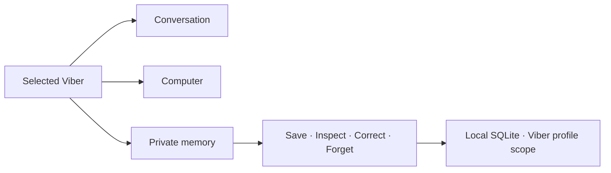

# Feature map

```mermaid
flowchart LR
    Viber["Selected Viber"] --> Chat["Conversation"]
    Viber --> Computer["Computer"]
    Viber --> Memory["Private memory"]
    Memory --> Facts["Save · Inspect · Correct · Forget"]
    Facts --> Storage["Local SQLite · Viber profile scope"]
```
