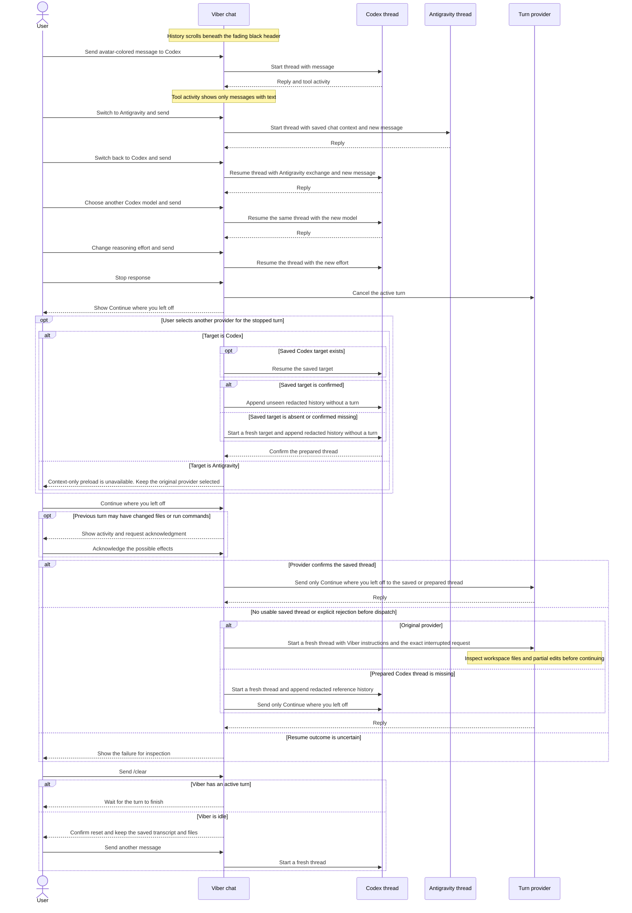
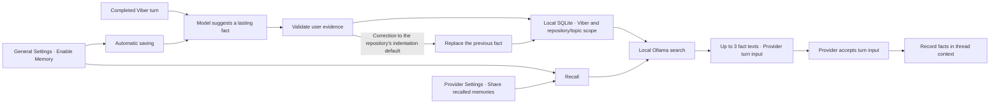
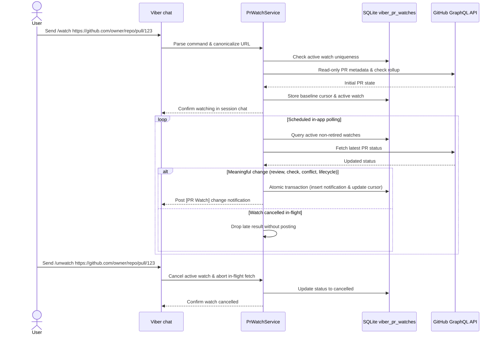

```mermaid
sequenceDiagram
    actor User
    participant Chat as Viber chat
    participant Codex as Codex thread
    participant AGY as Antigravity thread

    participant Provider as Turn provider
    Note over Chat: History scrolls beneath the fading black header
    User->>Chat: Send avatar-colored message to Codex
    Chat->>Codex: Start thread with message
    Codex-->>Chat: Reply and tool activity
    Note over Chat: Tool activity shows only messages with text
    User->>Chat: Switch to Antigravity and send
    Chat->>AGY: Start thread with saved chat context and new message
    AGY-->>Chat: Reply
    User->>Chat: Switch back to Codex and send
    Chat->>Codex: Resume thread with Antigravity exchange and new message
    Codex-->>Chat: Reply
    User->>Chat: Choose another Codex model and send
    Chat->>Codex: Resume the same thread with the new model
    Codex-->>Chat: Reply
    User->>Chat: Change reasoning effort and send
    Chat->>Codex: Resume the thread with the new effort
    User->>Chat: Stop response
    Chat->>Provider: Cancel the active turn
    Chat-->>User: Show Continue where you left off
    opt User selects another provider for the stopped turn
        alt Target is Codex
            opt Saved Codex target exists
                Chat->>Codex: Resume the saved target
            end
            alt Saved target is confirmed
                Chat->>Codex: Append unseen redacted history without a turn
            else Saved target is absent or confirmed missing
                Chat->>Codex: Start a fresh target and append redacted history without a turn
            end
            Codex-->>Chat: Confirm the prepared thread
        else Target is Antigravity
            Chat-->>User: Context-only preload is unavailable. Keep the original provider selected
        end
    end
    User->>Chat: Continue where you left off
    opt Previous turn may have changed files or run commands
        Chat-->>User: Show activity and request acknowledgment
        User->>Chat: Acknowledge the possible effects
    end
    alt Provider confirms the saved thread
        Chat->>Provider: Send only Continue where you left off to the saved or prepared thread
        Provider-->>Chat: Reply
    else No usable saved thread or explicit rejection before dispatch
        alt Original provider
            Chat->>Provider: Start a fresh thread with Viber instructions and the exact interrupted request
            Note over Provider: Inspect workspace files and partial edits before continuing
        else Prepared Codex thread is missing
            Chat->>Codex: Start a fresh thread and append redacted reference history
            Chat->>Codex: Send only Continue where you left off
        end
        Provider-->>Chat: Reply
    else Resume outcome is uncertain
        Chat-->>User: Show the failure for inspection
    end
    User->>Chat: Send /clear
    alt Viber has an active turn
        Chat-->>User: Wait for the turn to finish
    else Viber is idle
        Chat-->>User: Confirm reset and keep the saved transcript and files
        User->>Chat: Send another message
        Chat->>Codex: Start a fresh thread
    end
```

```mermaid
flowchart LR
    Viber["Completed Viber turn"] --> Suggest["Model suggests a lasting fact"]
    Settings["General Settings · Enable Memory"] --> Learn["Automatic saving"]
    Settings --> Recall["Recall"]
    Permissions["Provider Settings · Share recalled memories"] --> Recall
    Learn --> Suggest --> Evidence["Validate user evidence"]
    Evidence --> Storage["Local SQLite · Viber and repository/topic scope"]
    Evidence -- "Correction to the repository's indentation default" --> Replace["Replace the previous fact"] --> Storage
    Storage --> Ollama["Local Ollama search"]
    Recall --> Ollama --> Share["Up to 3 fact texts · Provider turn input"]
    Share --> Accept["Provider accepts turn input"] --> Record["Record facts in thread context"]
```

```mermaid
sequenceDiagram
    actor User
    participant Chat as Viber chat
    participant Watches as PrWatchService
    participant DB as SQLite viber_pr_watches
    participant GH as GitHub GraphQL API

    User->>Chat: Send /watch https://github.com/owner/repo/pull/123
    Chat->>Watches: Parse command & canonicalize URL
    Watches->>DB: Check active watch uniqueness
    Watches->>GH: Read-only PR metadata & check rollup
    GH-->>Watches: Initial PR state
    Watches->>DB: Store baseline cursor & active watch
    Watches-->>Chat: Confirm watching in session chat
    loop Scheduled in-app polling
        Watches->>DB: Query active non-retired watches
        Watches->>GH: Fetch latest PR status
        GH-->>Watches: Updated status
        alt Meaningful change (review, check, conflict, lifecycle)
            Watches->>DB: Atomic transaction (insert notification & update cursor)
            Watches-->>Chat: Post [PR Watch] change notification
        else Watch cancelled in-flight
            Watches->>Watches: Drop late result without posting
        end
    end
    User->>Chat: Send /unwatch https://github.com/owner/repo/pull/123
    Chat->>Watches: Cancel active watch & abort in-flight fetch
    Watches->>DB: Update status to cancelled
    Watches-->>Chat: Confirm watch cancelled
```
