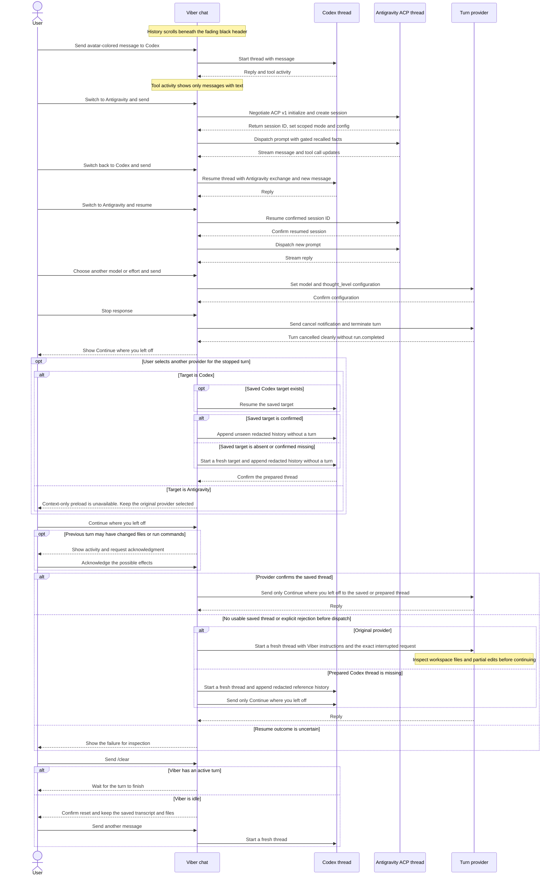
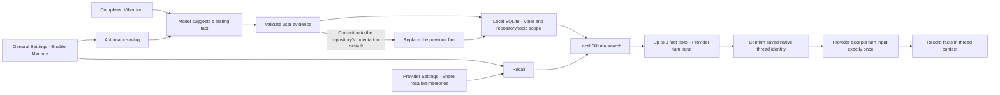

```mermaid
sequenceDiagram
    actor User
    participant Chat as Viber chat
    participant Codex as Codex thread
    participant AGY as Antigravity ACP thread

    participant Provider as Turn provider
    Note over Chat: History scrolls beneath the fading black header
    User->>Chat: Send avatar-colored message to Codex
    Chat->>Codex: Start thread with message
    Codex-->>Chat: Reply and tool activity
    Note over Chat: Tool activity shows only messages with text
    User->>Chat: Switch to Antigravity and send
    Chat->>AGY: Negotiate ACP v1 initialize and create session
    AGY-->>Chat: Return session ID, set scoped mode and config
    Chat->>AGY: Dispatch prompt with gated recalled facts
    AGY-->>Chat: Stream message and tool call updates
    User->>Chat: Switch back to Codex and send
    Chat->>Codex: Resume thread with Antigravity exchange and new message
    Codex-->>Chat: Reply
    User->>Chat: Switch to Antigravity and resume
    Chat->>AGY: Resume confirmed session ID
    AGY-->>Chat: Confirm resumed session
    Chat->>AGY: Dispatch new prompt
    AGY-->>Chat: Stream reply
    User->>Chat: Choose another model or effort and send
    Chat->>Provider: Set model and thought_level configuration
    Provider-->>Chat: Confirm configuration
    User->>Chat: Stop response
    Chat->>Provider: Send cancel notification and terminate turn
    Provider-->>Chat: Turn cancelled cleanly without run.completed
    Chat-->>User: Show Continue where you left off
    opt User selects another provider for the stopped turn
        alt Target is Codex
            opt Saved Codex target exists
                Chat->>Codex: Resume the saved target
            end
            alt Saved target is confirmed
                Chat->>Codex: Append unseen redacted history without a turn
            else Saved target is absent or confirmed missing
                Chat->>Codex: Start a fresh target and append redacted history without a turn
            end
            Codex-->>Chat: Confirm the prepared thread
        else Target is Antigravity
            Chat-->>User: Context-only preload is unavailable. Keep the original provider selected
        end
    end
    User->>Chat: Continue where you left off
    opt Previous turn may have changed files or run commands
        Chat-->>User: Show activity and request acknowledgment
        User->>Chat: Acknowledge the possible effects
    end
    alt Provider confirms the saved thread
        Chat->>Provider: Send only Continue where you left off to the saved or prepared thread
        Provider-->>Chat: Reply
    else No usable saved thread or explicit rejection before dispatch
        alt Original provider
            Chat->>Provider: Start a fresh thread with Viber instructions and the exact interrupted request
            Note over Provider: Inspect workspace files and partial edits before continuing
        else Prepared Codex thread is missing
            Chat->>Codex: Start a fresh thread and append redacted reference history
            Chat->>Codex: Send only Continue where you left off
        end
        Provider-->>Chat: Reply
    else Resume outcome is uncertain
        Chat-->>User: Show the failure for inspection
    end
    User->>Chat: Send /clear
    alt Viber has an active turn
        Chat-->>User: Wait for the turn to finish
    else Viber is idle
        Chat-->>User: Confirm reset and keep the saved transcript and files
        User->>Chat: Send another message
        Chat->>Codex: Start a fresh thread
    end
```

```mermaid
flowchart LR
    Viber["Completed Viber turn"] --> Suggest["Model suggests a lasting fact"]
    Settings["General Settings · Enable Memory"] --> Learn["Automatic saving"]
    Settings --> Recall["Recall"]
    Permissions["Provider Settings · Share recalled memories"] --> Recall
    Learn --> Suggest --> Evidence["Validate user evidence"]
    Evidence --> Storage["Local SQLite · Viber and repository/topic scope"]
    Evidence -- "Correction to the repository's indentation default" --> Replace["Replace the previous fact"] --> Storage
    Storage --> Ollama["Local Ollama search"]
    Recall --> Ollama --> Share["Up to 3 fact texts · Provider turn input"]
    Share --> Confirm["Confirm saved native thread identity"] --> Accept["Provider accepts turn input exactly once"] --> Record["Record facts in thread context"]
```
