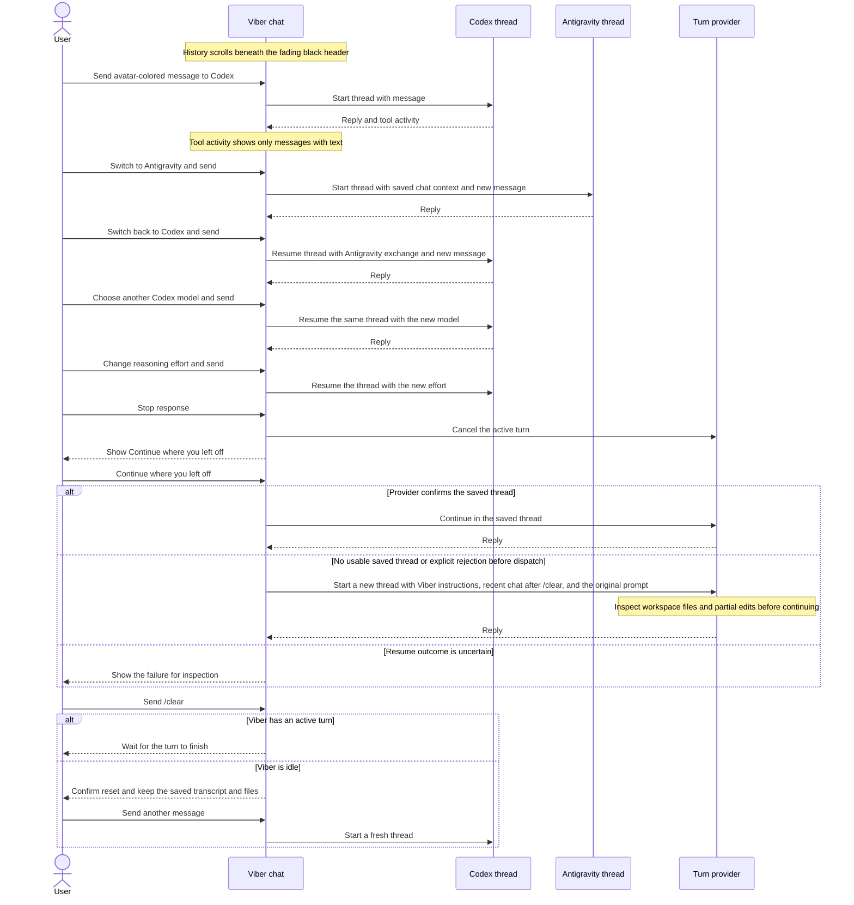

```mermaid
sequenceDiagram
    actor User
    participant Chat as Viber chat
    participant Codex as Codex thread
    participant AGY as Antigravity thread

    participant Provider as Turn provider
    Note over Chat: History scrolls beneath the fading black header
    User->>Chat: Send avatar-colored message to Codex
    Chat->>Codex: Start thread with message
    Codex-->>Chat: Reply and tool activity
    Note over Chat: Tool activity shows only messages with text
    User->>Chat: Switch to Antigravity and send
    Chat->>AGY: Start thread with saved chat context and new message
    AGY-->>Chat: Reply
    User->>Chat: Switch back to Codex and send
    Chat->>Codex: Resume thread with Antigravity exchange and new message
    Codex-->>Chat: Reply
    User->>Chat: Choose another Codex model and send
    Chat->>Codex: Resume the same thread with the new model
    Codex-->>Chat: Reply
    User->>Chat: Change reasoning effort and send
    Chat->>Codex: Resume the thread with the new effort
    User->>Chat: Stop response
    Chat->>Provider: Cancel the active turn
    Chat-->>User: Show Continue where you left off
    User->>Chat: Continue where you left off
    alt Provider confirms the saved thread
        Chat->>Provider: Continue in the saved thread
        Provider-->>Chat: Reply
    else No usable saved thread or explicit rejection before dispatch
        Chat->>Provider: Start a new thread with Viber instructions, recent chat after /clear, and the original prompt
        Note over Provider: Inspect workspace files and partial edits before continuing
        Provider-->>Chat: Reply
    else Resume outcome is uncertain
        Chat-->>User: Show the failure for inspection
    end
    User->>Chat: Send /clear
    alt Viber has an active turn
        Chat-->>User: Wait for the turn to finish
    else Viber is idle
        Chat-->>User: Confirm reset and keep the saved transcript and files
        User->>Chat: Send another message
        Chat->>Codex: Start a fresh thread
    end
```
